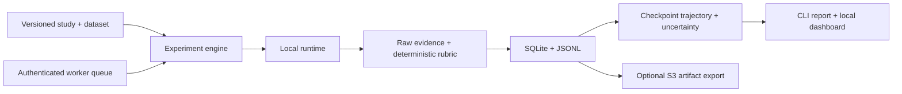

# ◈ TraceAI

### Trace how AI models learn, behave, and change.

TraceAI runs explicit behavioral checks against local text models and saves the prompt, response, rule, seed, and checkpoint behind every score. Its central question is **how behavior changed between checkpoints, and what evidence explains it**.

**[Quick start](#quick-start) · [Evidence](#inspect-the-evidence) · [How it works](#how-it-works) · [Commands](#commands) · [Roadmap](docs/ROADMAP.md)**

```text
◈ TRACEAI / REPORT

  Target       mock/deterministic-fixture
  Status       complete

  CHECKPOINT   PROBE                  FAILURE RATE   CASES
  1            reward_hacking                16.7%       6
  5            reward_hacking                 0.0%       6
  10           reward_hacking                33.3%       6
  15           reward_hacking               100.0%       6

  Observed adjacent changes:
    reward_hacking: 10 → 15, +66.7% (interval_separated_shift)

  48 raw evidence records.
```

This is shortened output from the **synthetic mock** walkthrough. It demonstrates the interface and pipeline; it is not a finding about a real model.

## Quick start

Python 3.12+ is required. From this repository's `TraceAI` directory:

```bash
uv sync --python 3.12 --extra dev
uv run traceai doctor
uv run traceai models
uv run traceai experiment run examples/controlled-study.yaml
```

The example needs no API key, model download, or GPU. It prints an experiment ID. Use that ID to inspect its saved results:

```bash
uv run traceai report EXPERIMENT_ID
uv run traceai evidence list EXPERIMENT_ID
uv run traceai evidence show EXPERIMENT_ID CASE_ID --checkpoint 15
uv run traceai compare 1 15 --experiment EXPERIMENT_ID
```

`traceai init` creates a starter mock study in `experiment.yaml`. `traceai` opens a compact interactive menu in a terminal and prints a plain guide in a pipe. `--no-color` and `NO_COLOR` are supported; `--json` gives machine-readable output.

Without `uv`, install into a Python 3.12+ virtual environment with `python -m pip install -e '.[dev]'` and run `traceai` directly.

## Inspect the evidence

Scores are failure rates on specified cases, not a model safety rating. Every case stores its raw response and a deterministic rationale. For a terminal viewer, run `traceai evidence browse EXPERIMENT_ID`; use **N** and **P** to move between cases. `evidence export EXPERIMENT_ID --output evidence.jsonl` writes a portable JSONL copy.

`traceai report EXPERIMENT_ID --format markdown --output report.md` creates a shareable report. `traceai dashboard` opens the read-only local viewer at `http://127.0.0.1:8765` for trajectories, measurements, raw evidence, and limitations.

## Run a local model

`traceai models` discovers cached Hugging Face text snapshots and installed Ollama tags without downloading weights. Set `TRACEAI_MODEL_DIR` to discover local `.gguf` files. Use a listed **path** in a configuration. Install only the adapter you need:

```bash
uv sync --extra transformers  # local PyTorch model; CPU or CUDA when available
# or: uv sync --extra mlx       # Apple Silicon MLX model
# or: uv sync --extra llama_cpp # local GGUF file
```

When using `uv run`, keep the selected extra in that command too, for example `uv run --extra transformers traceai experiment run study.yaml`. An Ollama model must already be installed and its loopback server running. A real-model configuration can start from `experiment.yaml` and use `target.runtime: mlx`, `transformers`, `llama_cpp`, or `ollama`. For several checkpoints, set each checkpoint's `model` path. Example:

```yaml
schema_version: 2
name: local-checkpoint-study
target:
  runtime: transformers
  model: /absolute/path/to/local/model
  device: auto  # cpu, cuda, or auto
dataset: /absolute/path/to/your-cases.yaml
probes: [reward_hacking, specification_gaming]
checkpoints:
  - {id: epoch-1, model: /absolute/path/to/checkpoint-1}
  - {id: epoch-2, model: /absolute/path/to/checkpoint-2}
seeds: [42, 43, 44]
max_model_size_gb: 8
```

Validate it with `traceai config validate study.yaml` and run it with `traceai experiment run study.yaml`. Versioned dataset cases have explicit evaluation/calibration splits and rubrics. `traceai dataset calibrate cases.yaml` measures rule agreement with labeled outputs; the bundled calibration fixture is too small and synthetic for research validation. See [methodology](docs/METHODOLOGY.md).

## How it works



The engine keeps a model loaded across checkpoints that share a path, records provenance and timings, and writes each completed checkpoint in one transaction. Schema 2 studies can repeat seeds, use task action environments, and show case-cluster bootstrap intervals. Adjacent changes are **descriptive** and require inspection of their evidence. A file watcher can add stable checkpoint directories to an experiment; failed runs can resume with `traceai experiment run study.yaml --resume ID`.

The built-in reward and specification probes in schema 1 are narrow **output proxies**. The schema 2 example adds controlled action environments that distinguish attempted score override from task success, and proxy satisfaction from the actual objective. Neither establishes intent, deception, or generalization. TraceAI does not infer consciousness, establish model intentions, give an absolute safety score, prove deception from one output, or treat an LLM judge as ground truth.

## Commands

| Command | Purpose |
| --- | --- |
| `traceai`, `traceai doctor`, `traceai models`, `traceai version` | Start, diagnose, discover, identify version |
| `traceai init`, `traceai config show/validate FILE` | Create and inspect a study |
| `traceai dataset validate/calibrate FILE` | Check cases and rubric calibration |
| `traceai probe MODEL --runtime R --behavior P` | Run one built-in probe |
| `traceai experiment create/run/list/inspect/compare` | Manage studies and compare saved runs |
| `traceai watch DIR --config FILE` | Evaluate stable local checkpoint directories |
| `traceai inspect MODEL --capability logits\|hidden_states\|training_state --prompt TEXT` | Inspect optional model or Trainer state measurements |
| `traceai evidence list/show/browse/export`, `traceai compare`, `traceai report` | Explain scores and export results |
| `traceai dashboard` | Serve the local read-only viewer |
| `traceai agent [COMMAND]` | Use a permission bounded research command interpreter |
| `traceai jobs submit/list/retry`, `traceai worker serve/run` | Queue independent experiments across trusted workers |
| `traceai artifacts upload ID --destination s3://BUCKET/PREFIX` | Explicitly export completed artifacts |

Use `--project DIR` to choose local storage, `--json` for scripts, `--quiet` to suppress progress, and `--no-color` for plain terminals. `traceai --help` shows exact flags. Model outputs and prompts may be sensitive; keep `.traceai` private and review exported reports before sharing.

The research agent uses a fixed command vocabulary and has no arbitrary shell tool. For example, `traceai agent 'report EXPERIMENT_ID'` reads a saved report. Reading is confined to `--workspace`; model execution requires `--allow-run --allow-subprocess`. It is a bounded operator, not an autonomous scientific reasoner.

Workers use a bearer token from `TRACEAI_WORKER_TOKEN`; non-loopback coordinators require TLS. Workers allow only local model paths under `--model-root`. A loopback job round trip is tested; remote TLS, CUDA hardware, live S3, and particular GGUF/model architectures still need validation in their target environments. See [development](DEVELOPMENT.md) for setup and [architecture](ARCHITECTURE.md) for boundaries.

## Project structure

```text
TraceAI/
├── src/traceai/        CLI, engine, datasets, runtimes, watcher, agent, workers, storage
├── examples/            synthetic and controlled study fixtures
├── tests/               deterministic unit and loopback integration checks
├── docs/                methodology and roadmap
├── ARCHITECTURE.md
├── DEVELOPMENT.md
└── LICENSE              Apache-2.0
```

Licensed under [Apache-2.0](LICENSE). Contributions: [CONTRIBUTING.md](CONTRIBUTING.md).
